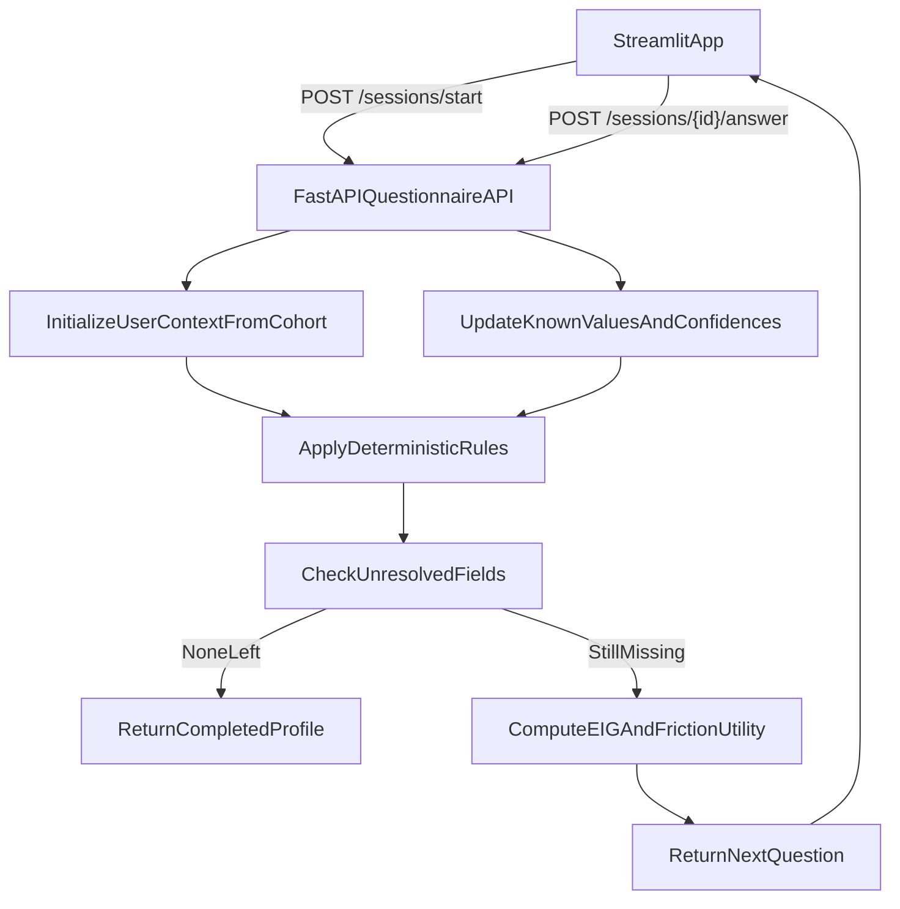

# Adaptive Questionnaire Agent Plan

## Repository Structure (Mapped to Implementation)

```text
schematics_ai_researcher_assignment/
├─ pyproject.toml
├─ uv.lock
├─ README.md
├─ .env.example
├─ docker-compose.yml
├─ Dockerfile.backend
├─ Dockerfile.frontend
├─ config.py
├─ scripts/
│  ├─ run_backend.sh
│  ├─ run_frontend.sh
│  └─ seed_mock_data.sh
├─ data/
│  ├─ raw/
│  ├─ generated/
│  └─ cohorts/
│     └─ cohort_definitions.yaml
├─ backend/
│  ├─ __init__.py
│  ├─ config.py
│  ├─ main.py
│  ├─ deps.py
│  ├─ data_generation/
│  │  ├─ __init__.py
│  │  ├─ config.py
│  │  ├─ enums.py
│  │  ├─ schemas.py
│  │  ├─ cohort_profiles.py
│  │  ├─ cohort_loader.py
│  │  ├─ latent_factors.py
│  │  ├─ generator.py
│  │  ├─ validators.py
│  │  └─ stats_report.py
│  ├─ core_logic/
│  │  ├─ __init__.py
│  │  ├─ config.py
│  │  ├─ enums.py
│  │  ├─ schemas.py
│  │  ├─ user_context.py
│  │  ├─ question_bank.py
│  │  ├─ deterministic_rules.py
│  │  ├─ priors_engine.py
│  │  ├─ entropy.py
│  │  ├─ info_gain.py
│  │  ├─ dropout_model.py
│  │  ├─ cost_benefit.py
│  │  ├─ adaptive_agent.py
│  │  └─ state_store.py
│  ├─ llm/
│  │  ├─ __init__.py
│  │  ├─ config.py
│  │  ├─ client.py
│  │  └─ prompt_templates.py
│  ├─ utils/
│  │  ├─ __init__.py
│  │  ├─ io_utils.py
│  │  ├─ logging_utils.py
│  │  ├─ metrics_utils.py
│  │  └─ seed_utils.py
│  ├─ api/
│  │  ├─ __init__.py
│  │  ├─ health.py
│  │  ├─ session.py
│  │  └─ questionnaire.py
│  ├─ services/
│  │  ├─ __init__.py
│  │  ├─ orchestrator.py
│  │  └─ inference_service.py
│  └─ models/
│     ├─ __init__.py
│     ├─ request_models.py
│     └─ response_models.py
├─ frontend/
│  ├─ __init__.py
│  ├─ config.py
│  ├─ app.py
│  ├─ api_client.py
│  ├─ session_state.py
│  └─ ui/
│     ├─ components.py
│     └─ pages.py
├─ tests/
│  ├─ conftest.py
│  ├─ unit/
│  │  ├─ test_generator.py
│  │  ├─ test_deterministic_rules.py
│  │  ├─ test_entropy.py
│  │  ├─ test_info_gain.py
│  │  ├─ test_cost_benefit.py
│  │  └─ test_adaptive_agent.py
│  └─ integration/
│     ├─ test_end_to_end_questionnaire.py
│     ├─ test_rule_then_model_fallback.py
│     └─ test_streamlit_fastapi_contract.py
└─ docs/
   ├─ architecture.md
   ├─ methodology.md
   ├─ evaluation_plan.md
   └─ api_contract.md
```

## Phase 1: Statistical Foundation & Data Generation

### 1.1 Define Pydantic Schemas
- Objective: Create strict models for the 10 target fields and enums for categorical values.
- Files:
  - [`backend/data_generation/schemas.py`](backend/data_generation/schemas.py)
  - [`backend/data_generation/enums.py`](backend/data_generation/enums.py)
  - [`backend/core_logic/schemas.py`](backend/core_logic/schemas.py)
- Deliverables:
  - `UserProfile`, `ObservedAnswer`, `InferredField`, `CohortFeatures` models.
  - Enum types for `credit_score_rate`, `loan_primary_purpose`, `property_type`, `property_use`, and range buckets.

### 1.2 Cohort Definition Engine
- Objective: Define cohort centroids in config form (YAML/JSON) and load safely.
- Files:
  - [`data/cohorts/cohort_definitions.yaml`](data/cohorts/cohort_definitions.yaml)
  - [`backend/data_generation/cohort_profiles.py`](backend/data_generation/cohort_profiles.py)
  - [`backend/data_generation/cohort_loader.py`](backend/data_generation/cohort_loader.py)
- Deliverables:
  - Cohort priors (e.g., Tech Veterans, Young Couples) with field-level probabilities/distributions.
  - Validation errors for malformed centroid definitions.

### 1.3 Latent Factors Model
- Objective: Implement hidden-variable drivers (affluence/risk) to induce realistic correlations.
- Files:
  - [`backend/data_generation/latent_factors.py`](backend/data_generation/latent_factors.py)
  - [`backend/data_generation/config.py`](backend/data_generation/config.py)
- Deliverables:
  - Latent variables such as `affluence_score` and `risk_profile`.
  - Parameterized mapping from latent scores to `annual_income`, `property_value`, `credit_line`.

### 1.4 Synthetic Generator
- Objective: Generate synthetic users using cohort priors + latent noise.
- Files:
  - [`backend/data_generation/generator.py`](backend/data_generation/generator.py)
  - [`scripts/seed_mock_data.sh`](scripts/seed_mock_data.sh)
  - [`data/generated/`](data/generated/)
- Deliverables:
  - Reproducible data generation with `numpy.random` and `scipy.stats`.
  - Batch dataset output (CSV/Parquet) with cohort labels and optional latent diagnostics.

### 1.5 Statistical Validation
- Objective: Verify realism with statistical diagnostics.
- Files:
  - [`backend/data_generation/validators.py`](backend/data_generation/validators.py)
  - [`backend/data_generation/stats_report.py`](backend/data_generation/stats_report.py)
  - [`docs/methodology.md`](docs/methodology.md)
- Deliverables:
  - Correlation matrix for key variables.
  - Distribution plots by cohort for major fields.
  - Pass/fail thresholds for distribution and correlation sanity.

## Phase 2: Deterministic Inference & Information Theory

### 2.1 Deterministic Rules Engine
- Objective: Resolve fields with hard-coded logic before adaptive questioning.
- Files:
  - [`backend/core_logic/deterministic_rules.py`](backend/core_logic/deterministic_rules.py)
  - [`backend/core_logic/config.py`](backend/core_logic/config.py)
  - [`tests/unit/test_deterministic_rules.py`](tests/unit/test_deterministic_rules.py)
- Deliverables:
  - Rules registry (age/cohort constraints and business logic).
  - Traceable explanation output for each rule fired.

### 2.2 Entropy & Information Gain
- Objective: Implement uncertainty and EIG math for each candidate question.
- Files:
  - [`backend/core_logic/entropy.py`](backend/core_logic/entropy.py)
  - [`backend/core_logic/info_gain.py`](backend/core_logic/info_gain.py)
  - [`tests/unit/test_entropy.py`](tests/unit/test_entropy.py)
  - [`tests/unit/test_info_gain.py`](tests/unit/test_info_gain.py)
- Deliverables:
  - Profile entropy calculation over unresolved fields.
  - Expected Information Gain computation per question.

## Phase 3: Adaptive Agent & Cost-Benefit Scoring

### 3.1 Question Metadata
- Objective: Define friction/dropout costs and metadata for all questions.
- Files:
  - [`backend/core_logic/question_bank.py`](backend/core_logic/question_bank.py)
  - [`backend/core_logic/config.py`](backend/core_logic/config.py)
  - [`docs/api_contract.md`](docs/api_contract.md)
- Deliverables:
  - `QuestionMeta` catalog with sensitivity, friction, targets, and prerequisites.

### 3.2 Utility Function
- Objective: Implement `Utility = EIG(q) - lambda * Friction(q)`.
- Files:
  - [`backend/core_logic/cost_benefit.py`](backend/core_logic/cost_benefit.py)
  - [`backend/core_logic/dropout_model.py`](backend/core_logic/dropout_model.py)
  - [`tests/unit/test_cost_benefit.py`](tests/unit/test_cost_benefit.py)
- Deliverables:
  - Question ranking score and calibration knobs (`lambda`, penalties) in config.

### 3.3 Sequential Decision Logic
- Objective: Build the ask-next vs stop-and-infer loop.
- Files:
  - [`backend/core_logic/adaptive_agent.py`](backend/core_logic/adaptive_agent.py)
  - [`backend/core_logic/user_context.py`](backend/core_logic/user_context.py)
  - [`backend/core_logic/state_store.py`](backend/core_logic/state_store.py)
  - [`tests/unit/test_adaptive_agent.py`](tests/unit/test_adaptive_agent.py)
- Deliverables:
  - Session decision loop with confidence threshold checks.
  - Finalization path returning inferred profile when stopping criteria are met.

## Phase 4: System Integration (FastAPI & Streamlit)

### 4.1 Backend Service
- Objective: Wire adaptive logic into FastAPI with session management.
- Files:
  - [`backend/main.py`](backend/main.py)
  - [`backend/api/session.py`](backend/api/session.py)
  - [`backend/api/questionnaire.py`](backend/api/questionnaire.py)
  - [`backend/services/orchestrator.py`](backend/services/orchestrator.py)
  - [`backend/models/request_models.py`](backend/models/request_models.py)
  - [`backend/models/response_models.py`](backend/models/response_models.py)
  - [`tests/integration/test_end_to_end_questionnaire.py`](tests/integration/test_end_to_end_questionnaire.py)
- Deliverables:
  - Endpoints for start session, submit answer, get next question, and fetch result.
  - Server-owned `UserContext` lifecycle and deterministic-first execution order.

### 4.2 Frontend UI
- Objective: Build Streamlit demo that visualizes adaptive behavior.
- Files:
  - [`frontend/app.py`](frontend/app.py)
  - [`frontend/api_client.py`](frontend/api_client.py)
  - [`frontend/session_state.py`](frontend/session_state.py)
  - [`frontend/ui/components.py`](frontend/ui/components.py)
  - [`tests/integration/test_streamlit_fastapi_contract.py`](tests/integration/test_streamlit_fastapi_contract.py)
- Deliverables:
  - One-question-at-a-time questionnaire flow.
  - “Agent’s Mind” panel with per-field confidence bars and inferred/known status.

## Phase 5: Evaluation, Dockerization & Delivery

### 5.1 Evaluation Suite
- Objective: Compare static questionnaire against adaptive agent.
- Files:
  - [`backend/utils/metrics_utils.py`](backend/utils/metrics_utils.py)
  - [`docs/evaluation_plan.md`](docs/evaluation_plan.md)
  - [`tests/integration/test_rule_then_model_fallback.py`](tests/integration/test_rule_then_model_fallback.py)
- Deliverables:
  - Metrics pipeline for completion rate, imputation accuracy, and average questions asked.
  - Baseline-vs-adaptive experiment definitions and result template.

### 5.2 Containerization
- Objective: Production-ready Docker setup using `uv` and Python 3.12.
- Files:
  - [`Dockerfile.backend`](Dockerfile.backend)
  - [`Dockerfile.frontend`](Dockerfile.frontend)
  - [`docker-compose.yml`](docker-compose.yml)
  - [`README.md`](README.md)
- Deliverables:
  - Multi-stage builds for backend/frontend with deterministic dependency installation.
  - `docker-compose` orchestration and documented run commands.

## Request Lifecycle (Streamlit -> FastAPI -> Agent)



## Definition of Done (Per Phase)

- Unit tests updated in [`tests/unit/`](tests/unit/) for affected modules.
- Integration tests updated in [`tests/integration/`](tests/integration/) for flow changes.
- Runtime-tunable constants moved to module config files, not hardcoded in logic.
- Google-style docstrings added for all functions/classes.
- `uv run python -m pytest tests/ -v --tb=short` passes before phase sign-off.
